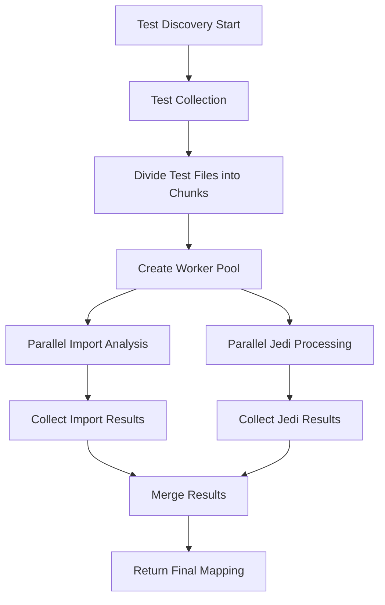

# Design Document

## Overview

This design implements parallel test discovery for CodeFlash by introducing a multi-process architecture that can process test files concurrently. The solution maintains compatibility with existing pytest and unittest frameworks while significantly improving performance through parallel processing of the most time-consuming operations: Jedi-based test file analysis and import analysis.

## Architecture

### Current Architecture Analysis

The current test discovery process follows this sequential flow:
1. **Test Collection**: Use pytest/unittest to collect all test files and functions
2. **Import Filtering**: Analyze test files to filter those that import target functions
3. **Jedi Processing**: Use Jedi to analyze each test file and find function references
4. **Result Aggregation**: Combine results into the final function-to-test mapping

The bottleneck is in steps 2 and 3, where each test file is processed individually using AST parsing and Jedi analysis.

### Proposed Parallel Architecture



## Components and Interfaces

### 1. ParallelTestDiscovery Class

**Purpose**: Main orchestrator for parallel test discovery

**Interface**:
```python
class ParallelTestDiscovery:
    def __init__(self, max_workers: Optional[int] = None, enable_parallel: bool = True):
        """Initialize parallel test discovery with configurable worker count."""
        
    def discover_tests(
        self, 
        cfg: TestConfig, 
        discover_only_these_tests: Optional[List[Path]] = None,
        functions_to_optimize: Optional[List[FunctionToOptimize]] = None
    ) -> Tuple[Dict[str, Set[FunctionCalledInTest]], int, int]:
        """Main entry point for parallel test discovery."""
```

### 2. WorkerPool Class

**Purpose**: Manages worker processes and task distribution

**Interface**:
```python
class WorkerPool:
    def __init__(self, max_workers: int):
        """Initialize worker pool with specified number of workers."""
        
    def map_parallel(self, func: Callable, tasks: List[Any]) -> List[Any]:
        """Execute function on tasks in parallel across workers."""
        
    def shutdown(self):
        """Clean shutdown of all worker processes."""
```

### 3. TestFileProcessor Class

**Purpose**: Handles processing of individual test files in worker processes

**Interface**:
```python
class TestFileProcessor:
    @staticmethod
    def process_import_analysis(task: ImportAnalysisTask) -> ImportAnalysisResult:
        """Analyze imports in a test file to check for target functions."""
        
    @staticmethod
    def process_jedi_analysis(task: JediAnalysisTask) -> JediAnalysisResult:
        """Use Jedi to analyze test file and find function references."""
```

### 4. Task and Result Data Classes

**Purpose**: Define data structures for inter-process communication

```python
@dataclass
class ImportAnalysisTask:
    test_file_path: Path
    target_functions: Set[str]

@dataclass
class ImportAnalysisResult:
    test_file_path: Path
    has_target_imports: bool
    error: Optional[str] = None

@dataclass
class JediAnalysisTask:
    test_file: Path
    test_functions: List[TestsInFile]
    project_root: Path
    test_framework: str

@dataclass
class JediAnalysisResult:
    test_file: Path
    function_mappings: Dict[str, Set[FunctionCalledInTest]]
    test_count: int
    replay_test_count: int
    error: Optional[str] = None
```

## Data Models

### Configuration Model

```python
@dataclass
class ParallelConfig:
    max_workers: Optional[int] = None  # Auto-detect if None
    enable_parallel: bool = True
    chunk_size: int = 1  # Files per task
    timeout_seconds: int = 300  # Per-file timeout
    fallback_on_error: bool = True  # Fall back to sequential on errors
```

### Progress Tracking Model

```python
@dataclass
class ProgressInfo:
    total_files: int
    completed_files: int
    failed_files: int
    current_phase: str  # "import_analysis" or "jedi_processing"
    start_time: float
    estimated_remaining: Optional[float] = None
```

## Error Handling

### Error Categories and Responses

1. **Worker Process Crashes**
   - **Detection**: Monitor worker health via process monitoring
   - **Response**: Restart worker, redistribute failed tasks
   - **Fallback**: Switch to sequential processing if multiple crashes occur

2. **Individual File Processing Errors**
   - **Detection**: Catch exceptions in worker processes
   - **Response**: Log error, continue with other files
   - **Fallback**: Return partial results, exclude failed files

3. **Resource Exhaustion**
   - **Detection**: Monitor memory usage and system load
   - **Response**: Reduce worker count dynamically
   - **Fallback**: Switch to sequential processing

4. **Timeout Errors**
   - **Detection**: Set per-file processing timeout
   - **Response**: Kill stuck worker, restart with new worker
   - **Fallback**: Skip problematic files after multiple timeouts

### Error Recovery Strategy

```python
class ErrorHandler:
    def __init__(self, max_retries: int = 3, fallback_threshold: int = 5):
        self.max_retries = max_retries
        self.fallback_threshold = fallback_threshold
        self.error_count = 0
        
    def handle_error(self, error: Exception, task: Any) -> ErrorAction:
        """Determine appropriate action for encountered error."""
        
    def should_fallback_to_sequential(self) -> bool:
        """Check if we should abandon parallel processing."""
```

## Testing Strategy

### Unit Tests

1. **ParallelTestDiscovery Tests**
   - Test worker pool initialization with different configurations
   - Test task distribution and result aggregation
   - Test error handling and fallback mechanisms

2. **WorkerPool Tests**
   - Test parallel execution with mock tasks
   - Test worker crash recovery
   - Test graceful shutdown

3. **TestFileProcessor Tests**
   - Test import analysis with various file types
   - Test Jedi analysis with different test frameworks
   - Test error handling for malformed files

### Integration Tests

1. **End-to-End Parallel Discovery**
   - Test complete parallel discovery flow with real test files
   - Compare results with sequential discovery for accuracy
   - Test performance improvements with large test suites

2. **Framework Compatibility**
   - Test with pytest-only projects
   - Test with unittest-only projects
   - Test with mixed framework projects

3. **Error Scenarios**
   - Test behavior with corrupted test files
   - Test behavior with missing dependencies
   - Test behavior under resource constraints

### Performance Tests

1. **Scalability Testing**
   - Measure performance with varying numbers of test files (10, 100, 1000+)
   - Test with different worker counts (1, 2, 4, 8, 16)
   - Compare sequential vs parallel execution times

2. **Resource Usage Testing**
   - Monitor memory usage during parallel processing
   - Monitor CPU utilization across different worker counts
   - Test behavior under memory pressure

## Implementation Phases

### Phase 1: Core Parallel Infrastructure
- Implement WorkerPool and task distribution
- Create basic TestFileProcessor for import analysis
- Add configuration and error handling framework

### Phase 2: Jedi Integration
- Implement parallel Jedi processing
- Add result aggregation and merging
- Integrate with existing test discovery flow

### Phase 3: Optimization and Polish
- Add progress tracking and reporting
- Implement dynamic worker scaling
- Add comprehensive error recovery

### Phase 4: Testing and Validation
- Comprehensive test suite implementation
- Performance benchmarking
- Documentation and examples