## Accurate Benchmarking on GPU devices (NVIDIA GPUs and Mac Metal Performance Shaders)

When a GPU operation is executed, it executes **asynchronously**. This means the CPU queues up work for the GPU and immediately continues to the next line of code - it doesn't wait for the GPU to finish. Accurate measurement of code execution on GPUs involves the insertion of synchronization barriers to ensure no pending GPU tasks are executing before and after the timing measurements are made.

## Illustration

### Without Synchronization

```mermaid actions={false}
%%{init: {'gantt': {'useWidth': 1200}}}%%
gantt
    title CPU vs CUDA Stream Timeline (Without Synchronization)
    dateFormat X
    axisFormat %s

    section CPU
    Timer Start           :milestone, m1, 0, 0
    Launch Kernel 1       :active, cpu0, 0, 4
    Launch Kernel 2       :active, cpu1, 4, 8
    Launch Kernel 3       :active, cpu2, 8, 12
    Timer End             :milestone, m2, 12, 12

    section CUDA Stream
    Waiting               :done, wait, 0, 4
    Kernel 1              :active, k1, 4, 11
    Kernel 2              :active, k2, 11, 18
    Kernel 3              :active, k3, 18, 25

    section Problem
    Timer ends too early  :done, p1, after m2, 25
```



Here you can see that the timing statements are measuring the duration up till the end of the final kernel launch. The GPU computation hasn't completed yet, which means the timing measurement is not accurate and would affect any future inference based on this information.

### With Synchronization

```mermaid actions={false}
%%{init: {'gantt': {'useWidth': 1200}}}%%
gantt
    title CPU vs CUDA Stream Timeline (With Synchronization)
    dateFormat X
    axisFormat %s

    section CPU
    Device Synchronization  :done, wait, 0, 4
    Timer Start             :milestone, m1, 4, 4
    Launch Kernel 1         :active, cpu0, 4, 8
    Launch Kernel 2         :active, cpu1, 8, 12
    Launch Kernel 3         :active, cpu2, 12, 16
    Device Synchronization  :done, wait, 16, 29
    Timer End               :milestone, m2, 29, 29

    section CUDA Stream
    Previous Work         :done, wait, 0, 4
    Kernel 1              :active, k1, 4, 11
    Kernel 2              :active, k2, 11, 18
    Kernel 3              :active, k3, 18, 29
```



Here you can see that a device synchronization call is made before executing the code, this ensures that the CPU waits for any pending GPU tasks to finish before starting the timer. After the launch of the final kernel, another device synchronization call is made which ensures all pending GPU tasks are finished before measuring the runtime.


## Pytorch Example

Execute the following code in your Python Interpreter to get the kernel launch time (Replace `cuda` with `mps` everywhere to run on your Mac).
```python
import torch
import time
device = "cuda"
x = torch.randn(8192, 8192, device=device)
y = torch.randn(8192, 8192, device=device)
t0 = time.perf_counter_ns()
z = torch.matmul(x, y)
t1 = time.perf_counter_ns()
print(f"Without synchronize: {(t1 - t0) / 1e6:.3f} ms")
```

Now, **Restart** your interpreter and execute the following code to get the kernel execution time (Replace `cuda` with `mps` everywhere to run on your Mac).
```python
import torch
import time
device = "cuda"
x = torch.randn(8192, 8192, device=device)
y = torch.randn(8192, 8192, device=device)
torch.cuda.synchronize()  # clear any pending work
t0 = time.perf_counter_ns()
z = torch.matmul(x, y)
torch.cuda.synchronize()  # wait for GPU to finish
t1 = time.perf_counter_ns()
print(f"With synchronize: {(t1 - t0) / 1e6:.3f} ms")
```


Output on NVIDIA GPU

```
Without synchronize: 69.157 ms
With synchronize: 152.277 ms
```

# How codeflash measures execution time involving GPUs

Codeflash automatically inserts synchronization barriers before measuring performance. It currently supports GPU code written in `Pytorch`, `Tensorflow` and `JAX`.

- **PyTorch**: Uses `torch.cuda.synchronize()` (NVIDIA GPUs) or `torch.mps.synchronize()` (MacOS Metal Performance Shaders) depending on the device.
- **JAX**: Uses `jax.block_until_ready()` to wait for computation to complete. It works for both CUDA and MPS devices.
- **TensorFlow**: Uses `tf.test.experimental.sync_devices()` for device synchronization. It works for both CUDA and MPS devices.

Codeflash would support ROCm and TPU devices in the near future.