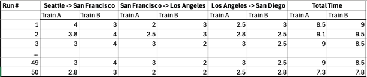

## How codeflash decides if an optimization is faster

Codeflash reports benchmarking results that look something like this.

⏱️ Runtime : 32.8 microseconds → 29.2 microseconds (best of 315 runs)

In this document we explain how we measure the runtime of code, how we determine if an optimization is faster, why we measure
timing as bes of N runs, how we measure the runtime of a wide variety of codes.

## Design of Codeflash auto-benchmarking

A core part of the design of Codeflash is that it does not make strong assumptions
of what types of optimizations are faster. Codeflash automatically benchmarks the code 
on a variety of inputs and determines empirically if the optimization is actually faster.

The aims behind the design of Codeflash auto-benchmarking are:
- Be able to accurately measure the runtime of code.
- Be able to measure runtime of a wide variety of codes.
- Be able to measure runtime of code on a variety of inputs.
- Do all the above on real machine, where there might be other processes running, creating timing measurement noise.
- Be able to make a binary decision on whether an optimization is faster or not.

A useful train analogy -
(timing decision is a binary decision)
Imagine that you are a train supervisor who is comparing that between two trains, Train A and Train B, which one is faster.

[//]: # (Your objective is to figure out which train is the fastest to go from Seattle to San Diego. )

[//]: # (The route first goes to San Francisco, Los Angeles and then ends at San Diego.)
You can measure the speed of the trains by timing how long it takes to go from San Francisco to Los Angeles.

Unfortunately, there are real life factors that can affect the speed of the trains. There might 
be rail traffic, weather conditions, terrain or other factors that can slow down the trains.

To settle the contest, you ask a train driver to race the two trains and run the trains as fast as possible.
You run both the trains A and B from San Francisco to Los Angeles and measure the time it takes.

Now the train A took 5% less time to do Seattle->San Diego than train B. But the driver complaints that
train B's run had poor weather on the way so they can't make conclusions yet. It is very important to definitively
know which train is faster.

You now ask the driver to repeat the race between the two trains multiple times.
Now in this world they have plenty of free time so they end up repeating the race 50 times.

This gives us timing data looking like the following. The units are in hours.

Now our task becomes seemingly harder to decide which train is faster because now there are 50x2 data points.

Unfortunately, the timing data is also noisy. Other trains might be running on the tracks, the weather might change, 
or the train might be delayed for some other reason. This makes it hard to determine which train is faster.

The crucial point is that, the noise in the timing data is not the fault of the train.
If we think about which train is fast - speed is a property of the train and not the hindrances.
The ideal way to decide the time would be to clear out all the hindrances and measure the time.
That way we would have a clean data set that is not noisy.

But in real life, we cannot do that. The best we can do is to try to minimize the noise, 
and get the "signal" which is the speed of the train, and not the noise which is the time added by hindrances.
Luckily, we can do that. When we repeat the race multiple times, we get multiple data points.
There will be a lot of cases where when the train goes between two stations, all the conditions are favorable,
and the train is able to run at its maximum speed. This will be when the noise is the least, and the
measured time will be the smallest. This is the "signal" we are looking for - the fastest speed that the train 
can achieve. The noise is only additive noise, i.e. when there is a hindrance, the time taken only increases, there is no
negative noise, which would make the train go faster.

So the key idea is that we find the minimum time that the train can achieve at a sector. That is very close to the fastest speed that the train can achieve.

## How Codeflash benchmarks code

From the above, it is clear that we want to measure the fastest speed, which corresponds to the minimum time that the train can achieve.
This has the least amount of additive noise, and is the most accurate measure of the intrinsic speed of the train.

The same idea applies to Codeflash . With processors, there are many different types of noise that can increase the runtime of a function.
The noise can be caused by -
- The hardware - there can be cache misses, cpu frequency scaling up and down, etc.
- the operating system - there can be context switches, memory allocation, etc.
- the language - there can be garbage collection, thread scheduling etc.

Codeflash tries to minimize the noise by running the function multiple times and taking the minimum time.
This is when the function is not slowed down by any hindrances. The processor frequency is at its maximum,
cache misses are not happening, the operating system is not doing any context switches etc.
This is the fastest speed that the function can achieve, and is the most accurate measure of the intrinsic speed of the function.

When Codeflash wants to measure if an optimization is faster than the original function, it runs the two functions
multiple times and takes the minimum time for both the functions. This most accurate measurement of the
intrinstic speed of the function, which is the signal we are looking for. We can now compare the two functions and see which one is faster.

We have found that when we run the function several times, the chance of getting "lucky" when the function is not 
slowed down by any hindrances gets very high. There codeflash tries to run the function as many times as reasonably possible.
Currently we loop the code for 10 seconds and a minimum of 5 loops, which gives us a good balance between accuracy of runtime of and the time it takes to run the function.

## What happens when there are multiple inputs to a function?

The above idea works well when there is only one input to a function. But what if there are multiple inputs?

Lets consider the train analogy again. Now the train goes between multiple stations. It first starts from Seattle up north, 
and then goes south to San Francisco, then Los Angeles, and finally terminating at San Diego. We want to again measure 
which train is the faster one on this route.

We can only measure the time taken by the train to go from one station to the next.

Here is how the timing data looks like. The units are in hours.

Now our task becomes seemingly harder to decide which train is faster because now there are 50x3x2 data points to consider.
Unfortunately, the timing data is also noisy. Running the same train on the same route might not give the same time, because 
of external factors like weather, traffic, etc. This makes it hard to determine which train is faster.

So, which train is faster?

The above insight of measuring the fastest speed of the train is still applicable here. But since there are multiple 
sectors, we need to measure the fastest speed of the train separately for each sector. This is because one sector might
have hills or winding tracks, which might slow down the train. But these will affect both the trains equally.

So to find the train that is fastest between the two stations, we find the minimum time taken by the train to go from one station to the next.
We then sum the minimum times for all the sectors to get the total time taken by the train to go from the first station to the last station.
The train that has the smallest sum of minimum times is the fastest train. Since this measures the intrinsic speed of the 
train on a given route.

This is the same idea that Codeflash applies to functions. It measures the intrinsic speed of a function on separate inputs. 
It then assumes a workload is composed of multiple inputs, and measures the intrinsic speed of the function on each input.
Then the instrinsic runtime of the function on the workload which consists of multipe inputs
is the sum of the intrinsic runtime of the function on each input.
(make drawings for each of the concepts)

We have found that this approach is very accurate and is the best way to measure the speed of a function, even in noisy Virtual machines.
We use a noise floor of 5% of the runtime, and only of the optimization is at least 5% faster than the original function, we consider it to be a significant improvement.
This technique gets rid of most of the measurement noise, and gives us a very accurate measure of the intrinsic speed of the function.

