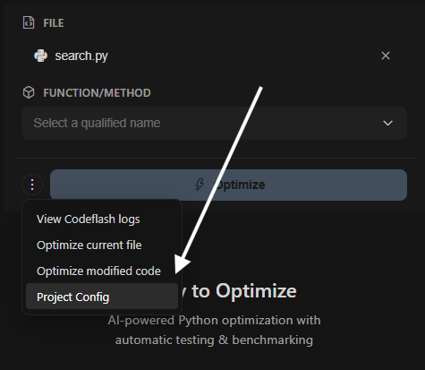

# Extension Configuration

Configure your Codeflash project settings through the extension's configuration page in the sidebar.

---

## Configuration Page

The Codeflash extension provides a configuration interface in the sidebar where you can view and update your project's `pyproject.toml` settings.

<Steps>
  <Step title="Open Codeflash Sidebar">
    Click the **Codeflash** icon in the VS Code activity bar (left sidebar) to open the extension panel. Make sure you're on the **Optimization** tab.
  </Step>
  <Step title="Open Kebab Menu">
    In the Optimization tab, look for the three vertical dots icon (`⋮`) next to the **Optimize** button. Click it to open the menu.
  </Step>
  <Step title="Select Project Config">
    From the dropdown menu, click **"Project Config"** to open the configuration interface.

    
  </Step>
  <Step title="Update Settings">
    Use the configuration interface to modify your `pyproject.toml` settings. Changes are saved directly to your project's configuration file.
  </Step>
</Steps>

<Info>
  The configuration page also appears automatically when:
  - The extension detects your project needs configuration
  - You need to update existing settings
  - The extension detects configuration issues
</Info>

<Info>
  **Configuration is project-specific** — All settings are stored in your project's `pyproject.toml` file, not in VS Code settings. This ensures your configuration is version-controlled and shared with your team.
</Info>

---

## Available Configuration Options

The extension's configuration page allows you to configure the following settings in your `pyproject.toml`:

### Module Root

Specifies which directory contains your Python source code to optimize.

- **Setting:** `module-root`
- **Example:** `"src"` or `"."`
- **Purpose:** Tells Codeflash where to find functions to optimize

### Tests Root

Specifies where your test files are located.

- **Setting:** `tests-root`
- **Example:** `"tests"` or `"test"`
- **Purpose:** Tells Codeflash where to find and create test files

### Code Formatter

Specifies which code formatter to use for optimized code.

- **Setting:** `formatter-cmds`
- **Options:** `black`, `ruff`, or custom commands
- **Purpose:** Ensures optimized code matches your project's style

### Additional Settings

The configuration page also supports other `pyproject.toml` settings such as:

- `git-remote` — Git repository remote URL
- `ignore-paths` — Paths to exclude from optimization
- `override-fixtures` — Custom test fixtures
- `benchmarks-root` — Directory for benchmark tests

---

## Manual Configuration

You can also edit `pyproject.toml` directly if you prefer:

1. Open `pyproject.toml` in your project root
2. Locate or create the `[tool.codeflash]` section
3. Add or modify configuration options

<Warning>
  **Format carefully** — Incorrect TOML syntax will cause the extension to show configuration errors. The extension's configuration page helps prevent syntax errors.
</Warning>

For a complete reference of all available `pyproject.toml` options, see the [Configuration Reference](/configuration).

---

## Python Interpreter Selection

The extension uses the Python interpreter selected in VS Code (via the Microsoft Python extension). To change the interpreter:

1. Press `Ctrl+Shift+P` / `Cmd+Shift+P`
2. Type **"Python: Select Interpreter"**
3. Choose your project's Python environment

<Info>
  The extension **automatically reloads** when you change the Python interpreter. Make sure Codeflash is installed in the selected environment.
</Info>

---

## Configuration Validation

The extension validates your configuration and shows helpful error messages if:

- `pyproject.toml` is missing or has syntax errors
- Required settings are not configured
- Paths specified don't exist
- Settings conflict with each other

When configuration issues are detected, the extension displays clear error messages and suggestions for fixing them.

---

## Next Steps

<CardGroup cols={2}>
  <Card title="Features" icon="sparkles" href="/editor-plugins/vscode/features">
    Learn about extension features
  </Card>
  <Card title="Troubleshooting" icon="wrench" href="/editor-plugins/vscode/troubleshooting">
    Fix common issues
  </Card>
  <Card title="Project Configuration" icon="file-code" href="/configuration">
    Complete pyproject.toml reference
  </Card>
</CardGroup>
