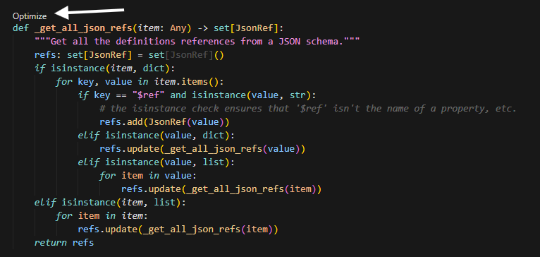
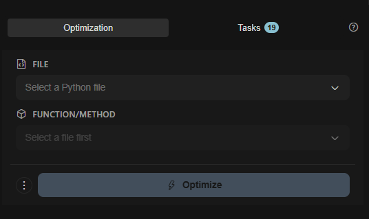
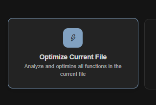
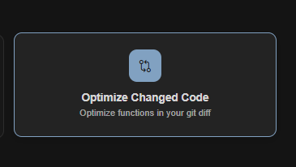
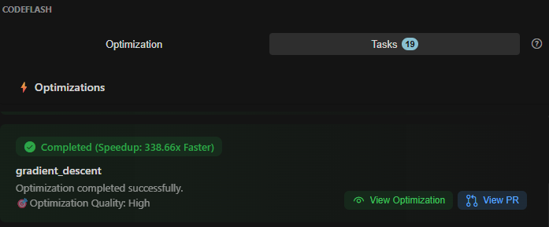
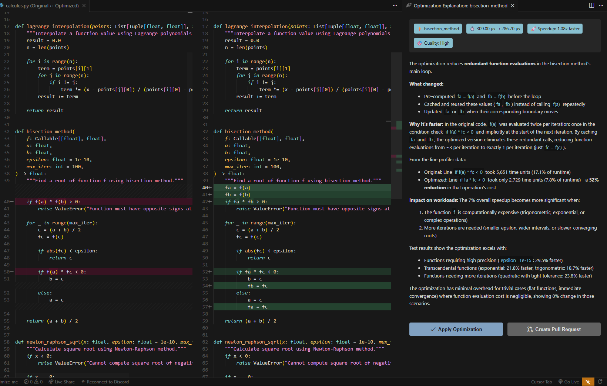

# Extension Features

The Codeflash VS Code extension provides a seamless optimization experience with inline suggestions, a dedicated sidebar panel, and multiple ways to select and optimize functions.

---

## Inline Optimization Suggestions (CodeLens)

The extension shows **"optimize"** hints directly above functions that can be optimized:

```python
# optimize ← Click this to start optimization
def process_data(items):
    result = []
    for item in items:
        if item > 0:
            result.append(item * 2)
    return result
```

**How it works:**

1. Open any Python file in your project
2. The extension analyzes your code automatically
3. Functions that can be optimized show an "optimize" hint above them

4. Click the hint to start optimization

<Tip>
  Look for CodeLens hints above functions in your editor for quick optimization
  access.
</Tip>

<Warning>
  Functions must be inside your configured `module-root` directory to show
  optimization hints. Check your `pyproject.toml` if hints aren't appearing.
</Warning>

---

## Sidebar Panel Overview

Access the Codeflash sidebar by clicking the Codeflash icon in the Activity Bar (left side of your editor).

The sidebar has two main tabs:

- **Optimization** — Select files and functions to optimize, or use quick actions
- **Tasks** — View and manage your optimization queue and completed optimizations

---

## Optimization Tab

The **Optimization** tab is your main interface for selecting code to optimize. It provides several ways to start optimizing:

### File and Function Selection



At the top of the Optimization tab, you'll find two dropdown selectors:

1. **FILE** — Select a Python file from your workspace

   - Click the dropdown to browse and select a Python file
   - The placeholder shows "Select a Python file" until you make a selection

2. **FUNCTION/METHOD** — Select a specific function to optimize

   - This dropdown is disabled until you select a file first
   - Once a file is selected, it populates with all optimizable functions (qualified names)
   - Functions are displayed with their fully qualified names (e.g., `MyClass.my_method` or `module.function_name`)

3. **Optimize Button** — Click the **Optimize** button (with lightning bolt icon) to queue the selected function for optimization

<Info>
  **Qualified Names** — Functions are displayed with their fully qualified
  names, making it easy to identify the exact function you want to optimize,
  including class methods and nested functions.
</Info>

### Quick Action Cards

Below the file/function selectors, you'll find two action cards for common optimization workflows:

#### Optimize Current File

- **Icon:** Lightning bolt

- **Action:** Analyze and optimize all functions in the currently opened file
- **How to use:** Click the card to optimize all functions in the active editor tab

<Warning>
  Optimizing all functions in a large file may take time. The extension will
  show you the count of functions and ask for confirmation before proceeding.
</Warning>

#### Optimize Changed Code

- **Icon:** Git diff symbol (intertwined links)

- **Action:** Optimize functions in your Git diff
- **How to use:** Click the card to automatically detect and optimize all modified functions in your current Git changes

<Tip>
  This is perfect for optimizing code you've just changed before committing. The
  extension will only optimize functions that are part of your current changes.
</Tip>

### Getting Started Section

When you first open the Optimization tab, you'll see a "Ready to Optimize" section with:

- A brief description: "AI-powered Python optimization with automatic testing & benchmarking"
- A **View Documentation** button to access help and guides

---

## Tasks Tab

The **Tasks** tab shows your optimization queue and completed optimizations. Switch to this tab to:

- View all queued optimizations
- Track progress of running optimizations
- Review completed optimizations

### Empty State

When you haven't started any optimizations yet, the Tasks tab shows:

- A rocket icon
- "No optimizations yet" message
- Instructions: "Add functions to the queue by clicking the small optimize button above a function"

### Completed Optimizations

Once optimizations complete, you'll see a list showing:


- **Function Name** — The name of the optimized function
- **Status Badge** — Shows completion status with speedup information:
  - "Completed (Xx Faster)" — Displays the performance improvement
  - Example: "Completed (2.5x Faster)" or "Completed (Speedup: 338.66x Faster)"
- **Optimization Quality** — Some optimizations show quality ratings (e.g., "Optimization Quality: High")
- **Actions:**
  - **View Optimization** button — Opens the diff view to see changes and apply them
  - **View PR** button — Opens the associated pull request (if optimization was created via PR)

<Info>
  The Tasks tab shows a badge count (e.g., "Tasks 19") indicating how many
  optimization tasks you have in total.
</Info>

---

## Optimization Workflow

Once you've selected functions to optimize (via any method above), here's what happens:

<Steps>
  <Step title="Queue Optimization">
    Selected functions are added to the optimization queue. You can see them in
    the Tasks tab.
  </Step>
  <Step title="Track Progress">
    Watch the Tasks tab for real-time updates: - Generating optimization
    candidates - Running tests to verify correctness - Benchmarking performance
  </Step>
  <Step title="Review Results">
    When complete, you'll see the optimization in the Tasks tab with: - Speedup
    information (e.g., "2.5x Faster") - Optimization quality rating - **View
    Optimization** button to see the diff
  </Step>
  <Step title="Apply Changes">
    Click **View Optimization** to see the full diff, then **Accept** to apply
    the optimization, or **Reject** to dismiss it.
  </Step>
</Steps>

---

## Reviewing Optimizations

After an optimization completes, you can review it in the Tasks tab or via inline comments.



### In the Tasks Tab

Click **View Optimization** on any completed optimization to see:

- Side-by-side comparison of original vs. optimized code
- Performance improvement percentage (speedup)
- Runtime comparison (original vs. optimized)
- Optimization quality rating
- Detailed explanation of what changed and why
- **Apply Optimization** button to accept the changes

### Inline Comments

The extension also shows inline comments on the optimized function in your editor with options to:

- **View Patch** — See the full diff of changes
- **Accept** — Apply the optimization to your code
- **Reject** — Dismiss the suggestion without changes

---

## Next Steps

<CardGroup cols={2}>
  <Card
    title="Configuration"
    icon="gear"
    href="/editor-plugins/vscode/configuration"
  >
    Customize extension settings
  </Card>
  <Card
    title="Troubleshooting"
    icon="wrench"
    href="/editor-plugins/vscode/troubleshooting"
  >
    Fix common issues
  </Card>
</CardGroup>
